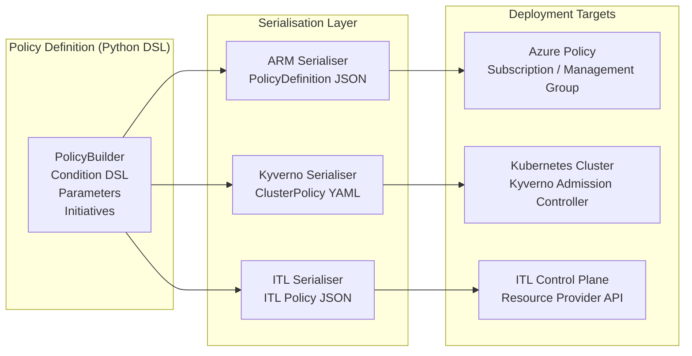
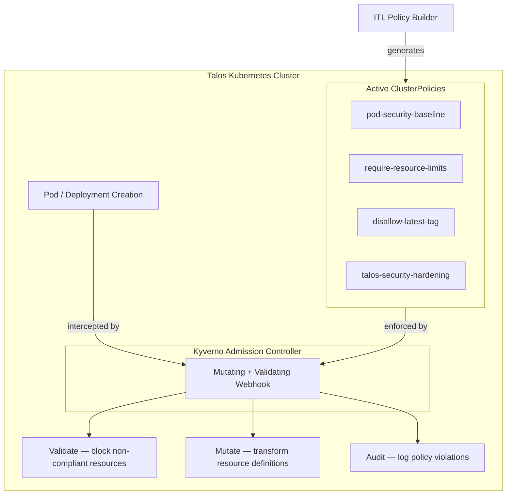
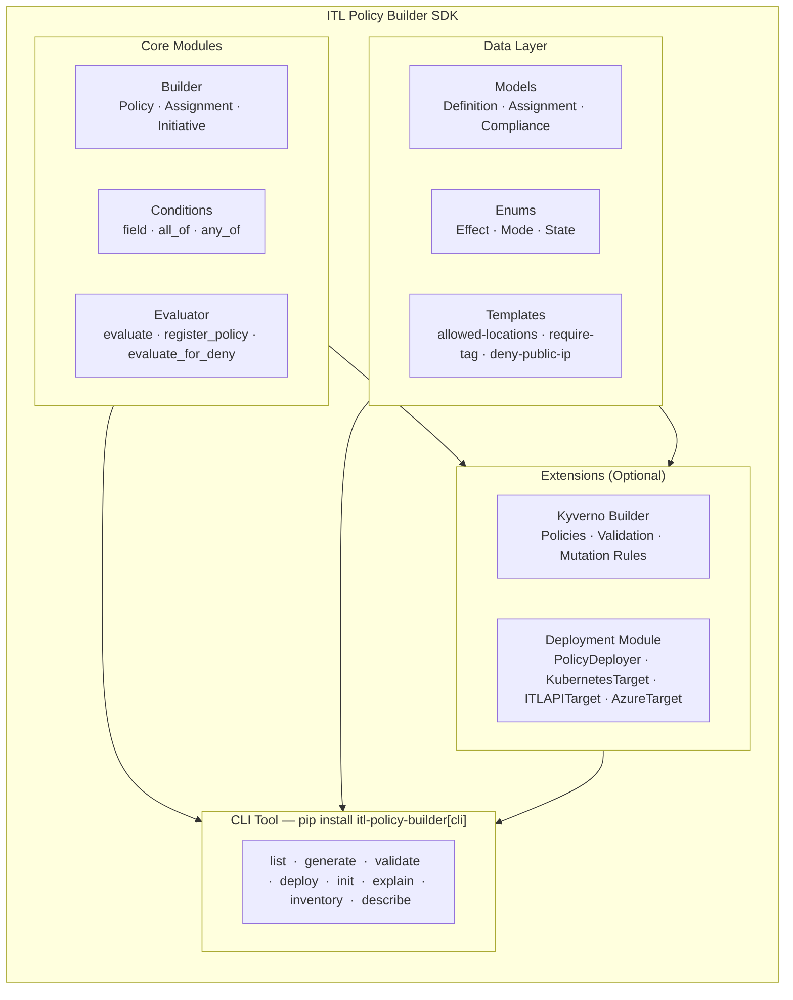

# ITL Policy Builder

Fluent DSL for defining governance policies for the ITL ControlPlane platform.

## Features

- **Fluent Builder Pattern** — Intuitive API for constructing policies
- **ARM-Compatible JSON** — Serialize to Azure Resource Manager format
- **Kyverno Support** — Kubernetes-native admission controller policies for Talos & K8s
- **Rich Condition DSL** — Express complex conditions with field operators
- **Built-in Templates** — Ready-to-use policies for common scenarios
- **BIO Compliance** — Dutch government security baseline (Baseline Informatiebeveiliging Overheid)
- **PQC Readiness** — Post-Quantum Cryptography migration policies (both ARM & Kyverno)
- **Policy Evaluator** — Evaluate resources against policies at runtime
- **Initiative Support** — Group policies into policy sets
- **Multi-policy Framework** — ARM (control plane), Kyverno (Kubernetes), and custom policies

## Multi-Platform Policy Builder

The ITL Policy Builder is designed around a single principle: **define once, deploy everywhere**. A policy is expressed using the Python DSL and can be serialised into the native format of any supported target platform without changing the business logic.

### Supported Platforms

| Platform | Output Format | Enforcement Mechanism | Typical Scope |
|---|---|---|---|
| **Azure Resource Manager** | `PolicyDefinition` JSON | Azure Policy engine (Deny / Audit / Modify) | Subscription, Management Group |
| **Kubernetes / Talos** | `ClusterPolicy` YAML | Kyverno admission webhook (Validate / Mutate / Audit) | Namespace, Cluster |
| **ITL Control Plane** | ITL Policy JSON | ITL Control Plane API (custom resource provider) | Tenant, Resource Group |

### Architecture



### Design Principles

- **Single source of truth** — The policy rule is written once in the DSL. Platform-specific serialisers handle the format differences.
- **Platform parity** — Core concepts (conditions, effects, parameters, initiatives) map to equivalent constructs on each platform.
- **Progressive deployment** — Policies can be deployed in `audit` mode on all platforms simultaneously before switching to enforcement.
- **Composable initiatives** — Multiple policies can be grouped into an initiative and assigned in a single operation, regardless of target platform.

---

## Installation

```bash
pip install itl-policy-builder
```

## Quick Start

### Define a Policy

```python
from itl_policy_builder import PolicyBuilder, Effect, field

# Create a policy that requires resources to be in West Europe
policy = (
    PolicyBuilder("require-westeurope")
    .display_name("Require West Europe Location")
    .description("Ensures all resources are deployed in West Europe")
    .category("General")
    .mode("All")
    .with_rule(
        if_=field("location").not_equals("westeurope"),
        then=Effect.DENY,
        message="Resources must be deployed in West Europe",
    )
    .build()
)

# Serialize to ARM JSON
print(policy.to_arm_json())
```

Output:
```json
{
  "id": "/providers/ITL.Authorization/policyDefinitions/require-westeurope",
  "name": "require-westeurope",
  "type": "ITL.Authorization/policyDefinitions",
  "properties": {
    "displayName": "Require West Europe Location",
    "description": "Ensures all resources are deployed in West Europe",
    "policyType": "Custom",
    "mode": "All",
    "metadata": {
      "category": "General"
    },
    "policyRule": {
      "if": {
        "field": "location",
        "notEquals": "westeurope"
      },
      "then": {
        "effect": "Deny",
        "message": "Resources must be deployed in West Europe"
      }
    }
  }
}
```

### Complex Conditions

```python
from itl_policy_builder import field, all_of, any_of, not_, count

# All of these conditions must be true
condition = all_of(
    field("location").in_("westeurope", "northeurope"),
    field("tags.environment").exists(),
    not_(field("type").equals("ITL.Core/resourceGroups")),
)

# At least one of these must be true
condition = any_of(
    field("properties.sku").equals("Standard"),
    field("properties.sku").equals("Premium"),
)

# Count elements in an array
condition = count("properties.networkInterfaces").greater_than(0)

# Count with filter
condition = count("properties.ipConfigurations").where(
    field("properties.publicIpAddress").exists()
).equals(0)  # No public IPs allowed

# Combine with operators
condition = (
    field("location").not_equals("westeurope") &
    field("tags.environment").exists()
)  # Using & for AND

condition = (
    field("sku").equals("Basic") |
    field("sku").equals("Standard")
)  # Using | for OR

condition = ~field("type").equals("ITL.Core/resourceGroups")  # Using ~ for NOT
```

### Policy with Parameters

```python
policy = (
    PolicyBuilder("allowed-locations")
    .display_name("Allowed Locations")
    .parameter(
        "allowedLocations",
        type="Array",
        display_name="Allowed Locations",
        description="List of allowed Azure regions",
        default=["westeurope", "northeurope"],
    )
    .parameter(
        "effect",
        type="String",
        default="Deny",
        allowed_values=["Deny", "Audit", "Disabled"],
    )
    .with_rule(
        if_=field("location").not_in("[parameters('allowedLocations')]"),
        then=Effect.DENY,
    )
    .build()
)
```

### Create Policy Assignments

```python
from itl_policy_builder import PolicyAssignmentBuilder

assignment = (
    PolicyAssignmentBuilder("enforce-tags-prod")
    .policy_definition_id(policy.id)
    .scope("/subscriptions/sub-prod-001")
    .display_name("Enforce Tags in Production")
    .parameter("allowedLocations", ["westeurope"])
    .exclude_scope("/subscriptions/sub-prod-001/resourceGroups/legacy-rg")
    .non_compliance_message("This resource violates location policy")
    .build()
)
```

### Create Initiatives (Policy Sets)

```python
from itl_policy_builder import PolicySetBuilder

initiative = (
    PolicySetBuilder("security-baseline")
    .display_name("Security Baseline")
    .description("Core security policies")
    .category("Security")
    .add_group("Tags", "Tagging requirements")
    .add_group("Network", "Network security")
    .add_policy(
        "/providers/ITL.Authorization/policyDefinitions/require-tag-environment",
        groups=["Tags"],
    )
    .add_policy(
        "/providers/ITL.Authorization/policyDefinitions/require-nsg",
        groups=["Network"],
    )
    .build()
)
```

### Use Built-in Templates

```python
from itl_policy_builder.templates import (
    get_builtin_policy,
    list_builtin_policies,
)

# List available built-in policies
for name, description in list_builtin_policies():
    print(f"{name}: {description}")

# Get a built-in policy
policy = get_builtin_policy(
    "allowed-locations",
    locations=["westeurope", "northeurope"],
)

# Require a specific tag
policy = get_builtin_policy(
    "require-tag",
    tag_name="environment",
    allowed_values=["dev", "test", "prod"],
)
```

### BIO Compliance Templates

BIO (Baseline Informatiebeveiliging Overheid) templates for Dutch government security standards:

```python
from itl_policy_builder import (
    get_bio_policy,
    list_bio_policies,
    get_bio_initiative,
    BIO_CATEGORIES,
)

# List available BIO policies (17 total)
for name, description, control in list_bio_policies():
    print(f"[{control}] {name}: {description}")

# Get a specific BIO policy
policy = get_bio_policy("bio-require-encryption-at-rest")

# Get policies by category
from itl_policy_builder import get_bio_policies_by_category
crypto_policies = get_bio_policies_by_category("BIO-10")  # Cryptografie

# Get complete BIO initiative (all 17 policies)
initiative = get_bio_initiative()
```

**BIO Categories:**
| Category | Description |
|----------|-------------|
| BIO-8 | Classificatie van informatie |
| BIO-9 | Toegangsbeheer |
| BIO-10 | Cryptografie |
| BIO-12 | Beveiliging bedrijfsvoering |
| BIO-13 | Communicatiebeveiliging |

**Available BIO Policies:**
- `bio-require-data-classification` — Verplicht dataclassificatie tag (BIV)
- `bio-require-owner` — Verplicht owner tag voor traceerbaarheid
- `bio-deny-anonymous-access` — Verbied publieke toegang
- `bio-require-encryption-at-rest` — Verplicht versleuteling voor opslag
- `bio-require-encryption-in-transit` — Verplicht TLS 1.2+
- `bio-require-diagnostic-logs` — Verplicht diagnostische logging
- `bio-require-log-retention` — Log retentie minimaal 90 dagen
- `bio-deny-public-endpoints` — Geen publieke endpoints voor gevoelige data
- `bio-require-nsg` — NSG verplicht op subnets
- `bio-deny-rdp-ssh-internet` — Geen RDP/SSH open naar internet
- `bio-allowed-locations-nl` — Alleen NL/EU datacenters

### PQC (Post-Quantum Cryptography) Templates

Templates for transitioning to quantum-safe cryptography based on NIST standards:

```python
from itl_policy_builder import (
    get_pqc_policy,
    list_pqc_policies,
    get_pqc_initiative,
    get_pqc_transition_initiative,
    PQC_CATEGORIES,
    NIST_PQC_KEMs,        # ["ML-KEM-512", "ML-KEM-768", "ML-KEM-1024"]
    NIST_PQC_SIGNATURES,  # ["ML-DSA-44", "ML-DSA-65", ...]
)

# List available PQC policies (16 total)
for name, description, category in list_pqc_policies():
    print(f"[{category}] {name}")

# Get a specific PQC policy
policy = get_pqc_policy("pqc-require-kem", allow_hybrid=True)

# Get complete PQC initiative (all 16 policies)
initiative = get_pqc_initiative()

# Get transition-only initiative (audit policies for planning phase)
transition = get_pqc_transition_initiative()
```

**PQC Categories:**
| Category | Description |
|----------|-------------|
| PQC-ALG | Quantum-Safe Algorithms |
| PQC-KEY | Key Management |
| PQC-TLS | Transport Security |
| PQC-CERT | Certificates |
| PQC-AUDIT | Migration & Audit |

**Available PQC Policies:**
- `pqc-require-kem` — Vereist ML-KEM (CRYSTALS-Kyber) key exchange
- `pqc-require-signature` — Vereist ML-DSA/SLH-DSA signatures
- `pqc-deny-deprecated` — Verbied RSA, ECDSA, Ed25519
- `pqc-require-hybrid` — Vereist hybrid mode (transitieperiode)
- `pqc-require-keyvault` — PQC-enabled Key Vault
- `pqc-require-key-rotation` — Key rotation maximaal 90 dagen
- `pqc-minimum-security-level` — NIST Level 3+ voor gevoelige data
- `pqc-require-tls` — PQC cipher suites
- `pqc-require-tls13` — TLS 1.3 vereist voor PQC KeyShare
- `pqc-require-certificates` — Quantum-safe certificaten
- `pqc-short-cert-validity` — Max 13 maanden geldigheid
- `pqc-require-readiness-tag` — PQC readiness tag (planning/hybrid/native/compliant)
- `pqc-audit-classical` — Audit quantum-kwetsbare crypto
- `pqc-deny-new-classical` — Blokkeer nieuwe klassieke crypto

### Evaluate Policies at Runtime

```python
from itl_policy_builder import PolicyEvaluator, PolicyBuilder, field, Effect

# Create evaluator
evaluator = PolicyEvaluator()

# Register policies
policy = (
    PolicyBuilder("require-westeurope")
    .with_rule(
        if_=field("location").not_equals("westeurope"),
        then=Effect.DENY,
    )
    .build()
)
evaluator.register_policy(policy)

# Register assignment
from itl_policy_builder import PolicyAssignmentBuilder

assignment = (
    PolicyAssignmentBuilder("enforce-location")
    .policy_definition_id(policy.id)
    .scope("/subscriptions/sub-prod-001")
    .build()
)
evaluator.register_assignment(assignment)

# Evaluate a resource
resource = {
    "id": "/subscriptions/sub-prod-001/resourceGroups/rg-1/providers/ITL.Compute/virtualMachines/vm-1",
    "name": "vm-1",
    "type": "ITL.Compute/virtualMachines",
    "location": "eastus",
    "properties": {},
}

result = evaluator.evaluate(resource)

if result.denied:
    print(f"Resource denied: {result.deny_reasons}")
else:
    print("Resource compliant")

# Quick deny check for middleware
should_deny, reasons = evaluator.evaluate_for_deny(resource)
```

## Policy Effects

| Effect | Description | Blocking |
|--------|-------------|----------|
| `Deny` | Block the operation | Yes |
| `Audit` | Log but don't block | No |
| `Append` | Add fields to the request | No |
| `Modify` | Modify existing fields | No |
| `DeployIfNotExists` | Deploy a resource if it doesn't exist | No |
| `AuditIfNotExists` | Audit if related resource doesn't exist | No |
| `Disabled` | Policy is disabled | No |
| `Remediate` | (ITL) Auto-fix non-compliant resources | No |
| `Alert` | (ITL) Send alert to monitoring | No |

## Field Operators

| Operator | Description |
|----------|-------------|
| `equals(value)` | Field equals value |
| `not_equals(value)` | Field does not equal value |
| `in_(*values)` | Field is one of values |
| `not_in(*values)` | Field is not one of values |
| `contains(value)` | Field contains substring/element |
| `not_contains(value)` | Field does not contain |
| `exists(bool)` | Field exists (or not) |
| `greater_than(n)` | Field > n |
| `greater_or_equals(n)` | Field >= n |
| `less_than(n)` | Field < n |
| `less_or_equals(n)` | Field <= n |
| `like(pattern)` | SQL-style LIKE (% wildcard) |
| `matches(regex)` | Regex match |

## Integration with API Gateway

The PolicyBuilder SDK integrates with the ITL ControlPlane API Gateway for runtime enforcement:

```python
# In API Gateway middleware
from itl_policy_builder import get_evaluator

async def policy_middleware(request, resource):
    evaluator = get_evaluator()
    
    should_deny, reasons = evaluator.evaluate_for_deny(resource)
    if should_deny:
        raise HTTPException(
            status_code=403,
            detail={
                "error": "PolicyViolation",
                "reasons": reasons,
            }
        )
    
    return await call_next(request)
```

---

## Kyverno Integration — Kubernetes-Native Policies

In addition to ARM-style policies, the PolicyBuilder SDK includes **Kyverno** — a Kubernetes-native admission controller for enforcing security, compliance, and governance policies on container workloads.

### Why Kyverno for Talos?

**Talos** is an immutable, minimal Linux distribution for Kubernetes. It pairs perfectly with **Kyverno** for:
- Pod security enforcement (prevent privileged containers)
- Image security (enforce approved registries, disable latest tags)
- Network isolation (require NetworkPolicies)
- PQC readiness (label workloads for quantum-safe crypto transition)

### Quick Start: Kyverno Policies

```python
from itl_policy_builder import (
    KyvernoPodSecurityBuilder,
    KyvernoImageSecurityBuilder,
    KyvernoPQCBuilder,
)

# Pod security policy
pod_policy = (
    KyvernoPodSecurityBuilder()
    .require_non_root()
    .require_security_context()
    .build()
)

print(pod_policy)
# → Kyverno ClusterPolicy YAML
```

### Kyverno Policy Types

| Builder | Purpose | Use Case |
|---------|---------|----------|
| `KyvernoPolicyBuilder` | Generic rule engine | Custom policies |
| `KyvernoPodSecurityBuilder` | Pod security hardening | PSS baseline/restricted |
| `KyvernoImageSecurityBuilder` | Container image controls | Registry whitelist, tag enforcer |
| `KyvernoNetworkPolicyBuilder` | Network isolation | Microsegmentation |
| `KyvernoPQCBuilder` | Post-quantum crypto readiness | PQC transition |

### Template Policies (Ready to Use)

```python
from itl_policy_builder.templates.kyverno import (
    get_talos_security_bundle,
    get_pqc_transition_bundle,
    get_pod_security_baseline,
    get_require_image_tag,
)

# Deploy all security policies for Talos
talos_policies = get_talos_security_bundle()
# Includes: pod-security-baseline, resource-limits, image-tag enforcement,
# network policies, privileged container denial, Talos-specific hardening

# Deploy for PQC transition
pqc_policies = get_pqc_transition_bundle()
# Includes: PQC readiness labels, shorter cert durations, Talos labels
```

### Building Custom Kyverno Policies

```python
from itl_policy_builder import (
    KyvernoPolicyBuilder,
    KyvernoMatch,
    MatchKind,
    ValidationAction,
)

# Require resource limits on all deployment containers
policy = (
    KyvernoPolicyBuilder("require-resource-limits")
    .with_display_name("Resource Limits Required")
    .with_description("All containers must specify CPU & memory requests/limits")
    .add_validation_rule(
        rule_name="check-limits",
        message="CPU and memory limits are required",
        pattern={
            "spec": {
                "containers": [
                    {
                        "resources": {
                            "requests": {"cpu": "?", "memory": "?"},
                            "limits": {"cpu": "?", "memory": "?"}
                        }
                    }
                ]
            }
        },
        match=KyvernoMatch(kind=MatchKind.POD),
        action=ValidationAction.ENFORCE,  # Deny if violated
    )
    .build()
)

# Export as YAML for kubectl apply
yaml_policy = policy.to_yaml()
```

### Mutation & Generation Rules

```python
from itl_policy_builder import KyvernoPolicyBuilder

# Auto-add labels to all pods
policy = (
    KyvernoPolicyBuilder("auto-label-pods")
    .with_display_name("Auto-label Pods")
    .add_mutation_rule(
        rule_name="add-environment-label",
        message="Adding environment label",
        patch={
            "metadata": {
                "labels": {
                    "environment": "production",
                    "managed-by": "kyverno"
                }
            }
        },
        match=KyvernoMatch(kind=MatchKind.POD),
    )
    .build()
)
```

### Available Kyverno Templates

| Policy | Category | Purpose |
|--------|----------|---------|
| `pod-security-baseline` | Security | PSS baseline (non-root, security context) |
| `pod-security-restricted` | Security | PSS restricted (strictest, read-only fs) |
| `disallow-privileged` | Security | Prevent privileged containers |
| `require-resource-limits` | Resources | Enforce CPU/memory requests & limits |
| `disallow-latest-tag` | Images | Prevent image:latest (no pinned versions) |
| `require-image-registry` | Images | Whitelist approved registries |
| `require-network-policies` | Network | Enforce NetworkPolicy labels |
| `pqc-cryptography-readiness` | PQC | Label workloads for PQC transition |
| `pqc-certificate-duration` | PQC | Enforce 90-day cert duration |
| `talos-security-hardening` | Talos | Talos-specific security settings |
| `require-talos-label` | Talos | Label pods as Talos-managed |
| `require-standard-labels` | Governance | Enforce app/team/env labels |
| `require-pdb` | HA | Require PodDisruptionBudget |

### Example: Deploy Talos Security Bundle

```bash
# Generate all Talos security policies as YAML
python -c "
from itl_policy_builder.templates.kyverno import get_talos_security_bundle
import yaml

for policy in get_talos_security_bundle():
    print(yaml.dump(policy))
    print('---')
" > talos-security-policies.yaml

# Apply to cluster
kubectl apply -f talos-security-policies.yaml

# Verify installation
kubectl get clusterpolicies
kubectl describe clusterpolicy pod-security-baseline
```

### Kyverno Architecture in ITL ControlPlane



---

## Command-Line Interface

The PolicyBuilder includes a powerful CLI tool for managing policies without writing code.

### Installation

```bash
# Install with CLI tools
pip install itl-policy-builder[cli]
```

### Quick CLI Usage

```bash
# List available policies
itl-policy list --category talos

# Generate Kyverno policies (Kubernetes)
itl-policy generate --template talos-security --style kyverno --output k8s.yaml

# Generate Azure ARM policies
itl-policy generate --template talos-security --style azure --output azure.json

# Validate policies
itl-policy validate --file k8s.yaml

# Deploy to Kubernetes
itl-policy deploy --file k8s.yaml --target kubernetes --action audit

# Explain what policies a template contains
itl-policy explain --template cis-azure --section AKS

# Explain an Azure governance concept
itl-policy explain --about management-group

# Inventory all policies in a subscription
itl-policy inventory --subscription-id "<sub-id>" --all-subscriptions

# Describe a live Azure resource by name
itl-policy describe subscription "Production" --format json
itl-policy describe policy-assignment cis-azure-baseline --subscription-id "<sub-id>"
```

### Generate Multiple Formats

The CLI supports generating policies in multiple styles:

- **`--style kyverno`** — Kubernetes-native Kyverno policies
- **`--style azure`** — Azure ARM Resource Manager policies
- **`--style custom`** — Extensible for future frameworks

See [Multi-Format Generation Guide](docs/MULTI_FORMAT_GENERATION.md) for detailed examples.

### CLI Commands

| Command | Purpose |
|---------|---------|
| `list` | List available policy templates |
| `generate` | Generate policies from templates (YAML/JSON) |
| `validate` | Validate policies before deployment |
| `deploy` | Deploy policies to Kubernetes, Azure, or ITL Control Plane |
| `init` | Initialize CLI configuration file |
| `explain` | Explain policy templates or Azure governance concepts (`--about`) |
| `inventory` | Inventory assignments, definitions, and initiatives across subscriptions |
| `describe` | Fetch live Azure details for a specific governance resource |

### Deployment Targets

- **Kubernetes** — Deploys as Kyverno ClusterPolicies
- **ITL Control Plane** — Registers policies via REST API
- **Both** — Deploy simultaneously to both targets

### Deploy Modes

- **Audit** (default) — Log violations without blocking
- **Enforce** — Block resources that violate policies
- **Dry-Run** — Simulate deployment without making changes

For comprehensive CLI documentation, see [CLI Guide](docs/CLI.md).

> **Note:** Historical implementation summaries and advisory documents (PQC action plans, risk assessments, monetisation strategy) have been moved to [`docs/archive/`](docs/archive/).

---

## Azure Deployment

Deploy ARM-compatible policies directly to Azure subscriptions using the native Azure SDK.

### Install Azure dependencies

```bash
pip install itl-policy-builder[azure]
```

### Deploy Policies to Azure (Python)

```python
import asyncio
from itl_policy_builder.deploy import PolicyDeployer, DeployConfig, DeployTarget, DeployAction
from itl_policy_builder import PolicyBuilder, Effect, field

# Build a policy
policy = (
    PolicyBuilder("require-westeurope")
    .display_name("Require West Europe Location")
    .description("Ensures all resources are deployed in West Europe")
    .category("General")
    .mode("All")
    .with_rule(
        if_=field("location").not_equals("westeurope"),
        then=Effect.DENY,
        message="Resources must be deployed in West Europe",
    )
    .build()
)

# Configure deployment
config = DeployConfig(
    target=DeployTarget.AZURE,
    azure_subscription_id="00000000-0000-0000-0000-000000000000",
    azure_tenant_id="your-tenant-id",        # optional
    azure_resource_group="rg-governance",    # optional
    azure_assignment_scope="/subscriptions/00000000-0000-0000-0000-000000000000",
    azure_credential="default",              # default | cli | env
    action=DeployAction.ENFORCE,
    dry_run=False,
)

deployer = PolicyDeployer(configs=[config])
results = asyncio.run(deployer.deploy([policy.to_arm_dict()]))
for r in results:
    print(r.summary)
```

### Deploy a Policy Set (Initiative) to Azure

```python
from itl_policy_builder import PolicySetBuilder

initiative = (
    PolicySetBuilder("security-baseline")
    .display_name("Security Baseline")
    .description("Core security policies")
    .category("Security")
    .version("1.0.0")
    .add_group("Tags", "Tagging requirements")
    .add_policy(
        "/providers/ITL.Authorization/policyDefinitions/require-tag-environment",
        groups=["Tags"],
    )
    .add_policy(
        "/providers/ITL.Authorization/policyDefinitions/deny-public-ip",
        groups=["Security"],
    )
)

# Serialize to ARM-compatible dict for deployment
arm_dict = initiative.to_azure_dict()
results = asyncio.run(deployer.deploy([arm_dict]))
```

### Deploy via CLI

```bash
# Generate BIO security initiative (Azure ARM format)
itl-policy generate --template talos-security --style azure --format json --output azure-bio.json

# Generate PQC transition initiative
itl-policy generate --template pqc-transition --style azure --format json --output azure-pqc.json

# Deploy to Azure
itl-policy deploy --file azure-bio.json --target azure \
  --subscription-id "00000000-0000-0000-0000-000000000000" \
  --assignment-scope "/subscriptions/00000000-0000-0000-0000-000000000000" \
  --action enforce

# Deploy with explicit Azure CLI auth
itl-policy deploy --file azure-bio.json --target azure \
  --subscription-id "sub-id" \
  --assignment-scope "/subscriptions/sub-id" \
  --azure-auth cli
```

### Azure Authentication Methods

| Method | Flag | Environment Variables |
|--------|------|-----------------------|
| DefaultAzureCredential (auto) | `--azure-auth default` | — |
| Azure CLI (`az login`) | `--azure-auth cli` | — |
| Service Principal | `--azure-auth env` | `AZURE_CLIENT_ID`, `AZURE_CLIENT_SECRET`, `AZURE_TENANT_ID` |

For detailed Azure guidance, see [Azure Quick Reference](docs/AZURE_QUICK_REFERENCE.md).

---

## Examples

### Explore Policy Examples

The PolicyBuilder includes comprehensive examples in the `examples/` directory:

**Kyverno Examples** — See [examples/kyverno_examples.py](examples/kyverno_examples.py)
```bash
# Run Kyverno examples
python examples/kyverno_examples.py
```

Examples include:
- Pod security baseline policies
- Image security (registry whitelist, tag enforcement)
- Custom validation rules
- PQC readiness policies
- Talos security bundle deployment
- Mutation rules (auto-labeling)

**Azure ARM Examples** — See [examples/azure_examples.py](examples/azure_examples.py) (NEW)
```bash
# Run Azure ARM examples
python examples/azure_examples.py
```

Examples include:
- Location enforcement policies
- Tagging requirements
- Complex conditions (AND/OR/NOT)
- Built-in template usage
- BIO (Dutch government) compliance policies
- PQC readiness for Azure
- Policy assignments and initiatives
- Export to JSON and YAML

**CLI Examples** — See [examples/cli_examples.md](examples/cli_examples.md)
```bash
# Run CLI workflows
itl-policy generate --template talos-security --style kyverno
itl-policy generate --template talos-security --style azure
itl-policy deploy --file policies.yaml --target kubernetes
```

Workflows include:
- Kyverno generation and deployment
- Azure ARM policy creation and assignment
- Multi-environment deployments
- Development and testing pipelines

---

## Architecture



## License

Apache 2.0 — See [LICENSE](LICENSE)
